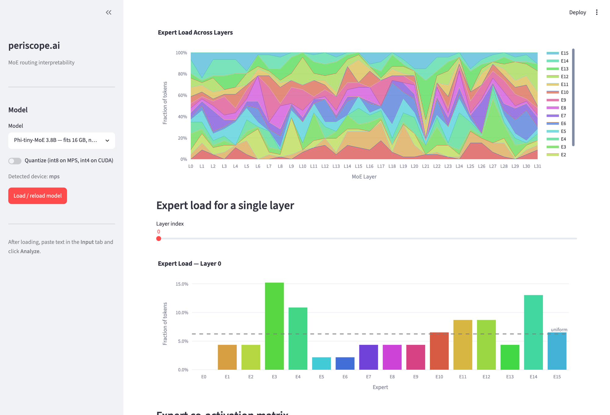

# periscope.ai

A local interpretability tool for visualizing how Mixture-of-Experts (MoE) language models route tokens through their expert layers.



## What is MoE routing?

In a Mixture-of-Experts LLM, each transformer layer contains multiple independent feed-forward networks called **experts**. A lightweight **router** (a single linear layer) decides, for every token, which top-k experts should process it. Only those k experts run — the rest are skipped.

This sparse activation is what makes large MoE models efficient: a model like Phi-tiny-MoE has 3.8B total parameters but only activates ~1.1B per token.

periscope.ai makes this routing visible:

| View | What it shows |
|------|--------------|
| **Expert assignment heatmap** | Which expert each token is routed to, across every MoE layer |
| **Routing entropy** | How confident the router is — low entropy means one expert dominates, high entropy means weight is spread |
| **Token routing path (Sankey)** | A single token's journey through expert layers, with edge widths proportional to routing weight |
| **Expert load across layers** | How evenly tokens are distributed across experts, and whether that changes with depth |
| **Expert co-activation matrix** | Which expert pairs are consistently selected together for the same token |

## Supported models

| Model | Total params | Active params | VRAM needed |
|-------|-------------|---------------|-------------|
| `microsoft/Phi-tiny-MoE-instruct` | 3.8B | 1.1B | ~8 GB (bfloat16, no quant) |
| `allenai/OLMoE-1B-7B-0924` | 7B | 1B | ~7 GB (int8 quant) |
| `mistralai/Mixtral-8x7B-v0.1` | 46.7B | ~12B | ~26 GB (int4 quant) |

**16 GB M-series Mac**: use Phi-tiny-MoE (default) with quantization off.

## Setup

```bash
git clone https://github.com/lmontigny/periscope.ai
cd periscope.ai

uv venv
uv pip install -r requirements.txt

cp .env.example .env   # optionally edit MODEL_ID
```

## Run

```bash
uv run streamlit run app.py
```

Then open [http://localhost:8501](http://localhost:8501) in your browser.

## Usage

1. The model loads automatically on startup (first run downloads weights from HuggingFace).
2. Go to the **Input** tab, paste any text, and click **Analyze**.
3. Switch to **Token Routing** to see the expert assignment heatmap, routing entropy, and the per-token Sankey diagram.
4. Switch to **Expert Stats** for load distribution across layers and the co-activation matrix.

## How it works

Routing data is captured via PyTorch **forward hooks** registered on the router linear layer inside each MoE block. A single forward pass (no generation) is enough — the hooks record the raw logits output for every layer, which are then used to compute softmax probabilities, top-k expert selections, and all derived metrics.

No model weights are modified. Hooks are removed after each analysis run.
